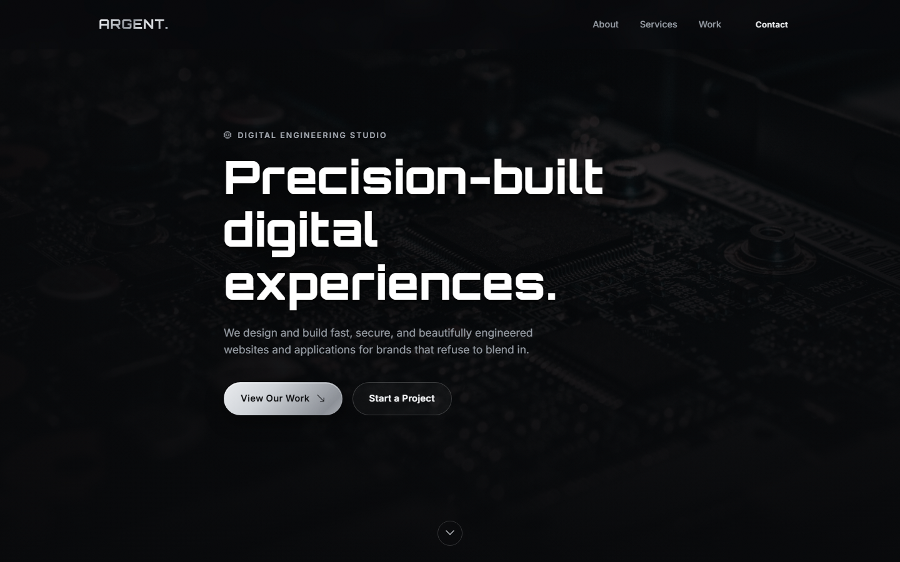
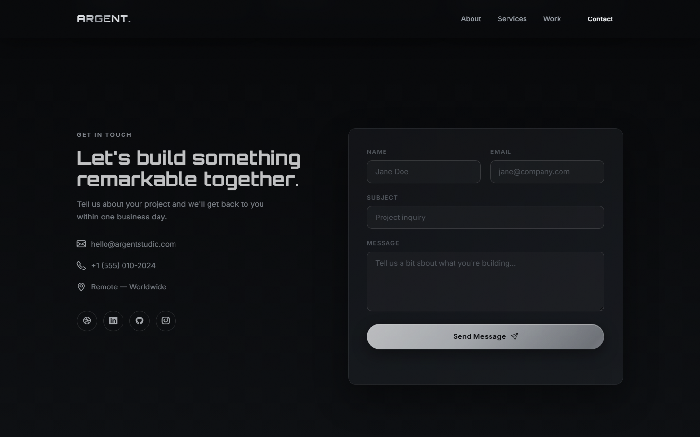

# ARGENT — Dark & Silver Metallic One-Pager

A single-page site with a dark/silver metallic theme, built as **plain
HTML5, CSS3, and vanilla JavaScript** — no framework, no build step, no
`node_modules` needed to run it. All interactivity (nav toggle, scroll
reveals, animated stat counters, and the contact form) is hand-written JS.
The contact form sends mail client-side via **EmailJS** — no backend
required.





## Stack

- `index.html` — the entire page markup.
- `css/style.css` — hand-written CSS3, no framework/utility classes.
- `js/main.js` — vanilla JS (IIFE, no dependencies).
- `@emailjs/browser` — loaded from CDN, wired up in `main.js`.
- Fonts: Orbitron + Inter via Google Fonts CDN. Icons: Bootstrap Icons
  (CDN). Photography: Unsplash (hotlinked).

## Running it

There's nothing to build. Either:

- Open `index.html` directly in a browser, **or**
- Serve it locally so the contact form's network requests behave like a
  real deployment:

  ```bash
  npx serve -l 3005 .
  ```

  then open http://localhost:3005.

## Connect the contact form (EmailJS)

1. Create a free account at https://www.emailjs.com
2. **Email Services** → add a service (e.g. Gmail) → copy its **Service ID**
3. **Email Templates** → create a template that uses these fields:
   `user_name`, `user_email`, `subject`, `message` → copy its **Template ID**
4. **Account → General** → copy your **Public Key**
5. Open [`js/main.js`](js/main.js) and fill in the three constants near the
   top:

   ```js
   var EMAILJS_SERVICE_ID = "YOUR_SERVICE_ID";
   var EMAILJS_TEMPLATE_ID = "YOUR_TEMPLATE_ID";
   var EMAILJS_PUBLIC_KEY = "YOUR_PUBLIC_KEY";
   ```

Until these are filled in, submitting the form shows a friendly inline
message instead of silently failing.

## Deploying

Copy `index.html`, `css/`, `js/`, and `favicon.ico` to any static host —
Apache, Nginx, GitHub Pages, Netlify, S3, anywhere that serves files. No
Node.js needs to run on the server at all.

## Customizing

- Copy, brand name, nav links, stats, services, and work items live
  directly in [`index.html`](index.html).
- Theme colors, the chrome/metallic text effect, and layout live in
  [`css/style.css`](css/style.css) (`:root` custom properties at the top
  control the palette).
- Swap the Unsplash photo URLs in `index.html` for your own images at any
  time — they're plain `` tags.
